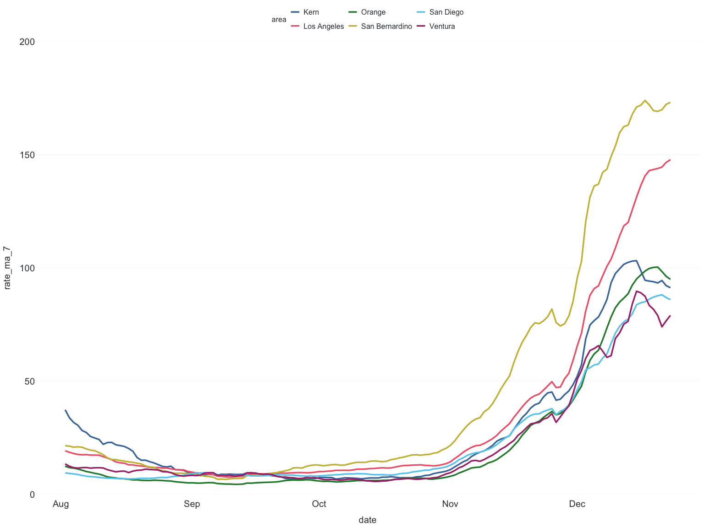

# jarvis


## Installation

``` r
pak::pak("ericmshearer/jarvis")
```

## Tables

`tbl()`

- `scaled` controls whether or not percent is multiplied by 100.
- `digits` sets rounding.
- For tables \>1 variable, can pivot long to wide by setting `pivot` to
  TRUE.

``` r
linelist |>
  tbl(Gender)
#> # A tibble: 4 × 3
#>   Gender     n percent
#>   <chr>  <int>   <dbl>
#> 1 D          6     5.7
#> 2 F         51    48.6
#> 3 M         39    37.1
#> 4 U          9     8.6
```

``` r
linelist |>
  tbl(Gender, Ethnicity, pivot = TRUE)
#> # A tibble: 4 × 4
#>   Gender `Hispanic or Latino` `Non-Hispanic or Latino` Unknown
#>   <chr>                 <int>                    <int>   <int>
#> 1 D                         1                        4       1
#> 2 F                         8                       42       1
#> 3 M                         7                       27       5
#> 4 U                         3                        6       0
```

`tbl_totals()`

- Default calculates column totals. For row, set `loc` to “row”. Or can
  use “both”.
- Name of summed cell defaults to “Total”. To change, update `name`.

``` r
linelist |>
  tbl(Race) |>
  tbl_totals()
#> # A tibble: 9 × 3
#>   Race                                          n percent
#>   <chr>                                     <dbl>   <dbl>
#> 1 American Indian or Alaska Native             15    14.3
#> 2 Asian                                        11    10.5
#> 3 Black or African American                    16    15.2
#> 4 Multiple Races                                6     5.7
#> 5 Native Hawaiian or Other Pacific Islander    15    14.3
#> 6 Other                                        16    15.2
#> 7 Unknown                                       9     8.6
#> 8 White                                        17    16.2
#> 9 Total                                       105   100
```

`tbl_percentage()`

- Control rounding via `digits`.
- Default calculates column percentages. For row, set `loc` to “row”.

``` r
linelist |>
  tbl(Race, Ethnicity, pivot = TRUE) |>
  tbl_percentage()
#> # A tibble: 8 × 4
#>   Race                       `Hispanic or Latino` Non-Hispanic or Lati…¹ Unknown
#>   <chr>                                     <dbl>                  <dbl>   <dbl>
#> 1 American Indian or Alaska…                 26.3                   11.4    14.3
#> 2 Asian                                      21.1                    8.9     0  
#> 3 Black or African American                   0                     19      14.3
#> 4 Multiple Races                              0                      7.6     0  
#> 5 Native Hawaiian or Other …                 26.3                   11.4    14.3
#> 6 Other                                       5.3                   17.7    14.3
#> 7 Unknown                                     5.3                    8.9    14.3
#> 8 White                                      15.8                   15.2    28.6
#> # ℹ abbreviated name: ¹​`Non-Hispanic or Latino`
```

## Data Visualization

`scale_percent()`

For unscaled percentages (i.e. not multiplied by 100), update `scale` to
FALSE.

``` r
linelist |>
  count(Race) |>
  mutate(percent = add_percent(n)) |>
  ggplot(aes(x = Race, y = percent)) +
  geom_bar(stat = "identity") +
  scale_x_discrete(label = wrap_labels(delim = "or")) +
  scale_y_continuous(expand = c(0,0), label = scale_percent()) +
  theme_apollo()
```


`scale_color_apollo()`

- Current palettes: Bright, Muted, Okabe Ito.
- Reverse palette via `reverse`, logical.

``` r
covid <- read.csv("https://data.chhs.ca.gov/dataset/f333528b-4d38-4814-bebb-12db1f10f535/resource/046cdd2b-31e5-4d34-9ed3-b48cdbc4be7a/download/covid19cases_test.csv", na.strings = "", stringsAsFactors = FALSE) |>
  filter(area %in% c("Orange","Los Angeles","San Diego","Ventura","San Bernardino","Kern"))

covid <- covid |>
  group_by(area) |>
  mutate(
    date = as.Date(date, "%Y-%m-%d"),
    rate = rate_per_100k(cases, population, digits = 1),
    rate_ma_7 = round(zoo::rollmean(rate, k = 7, align = "right", na.pad = FALSE, fill = 0), digits = 2)
  ) |>
  ungroup() |>
  filter(date <= "2020-12-23", date > "2020-08-01")

ggplot(data = covid, aes(x = date, y = rate_ma_7, color = area)) +
  geom_line(linewidth = 1.2) +
  theme_apollo() +
  scale_y_continuous(expand = c(0,0), limits = c(0,200)) +
  scale_color_apollo(name = "Bright")
```



`expand_x()`

For time series plots that need a little more room on the x-scale to fit
everything, including end point labels. Input should be class numeric,
and is relative to the scale of your axis.

``` r
ggplot(data = covid, aes(x = date, y = rate_ma_7, color = area)) +
  geom_line(linewidth = 1.2) +
  geom_text(data = end_points(covid, date), aes(label = area), size = 4.5, hjust = -0.1, show.legend = FALSE) +
  theme_apollo() +
  scale_x_date(expand = expand_x(20)) +
  scale_y_continuous(expand = c(0,0), limits = c(0,200)) +
  scale_color_apollo(name = "Bright")
```


